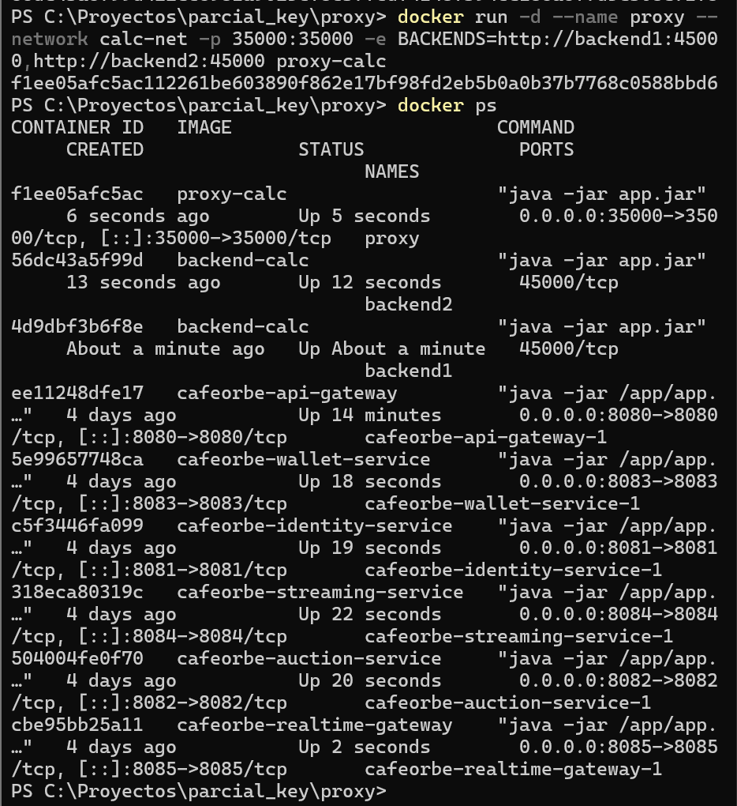
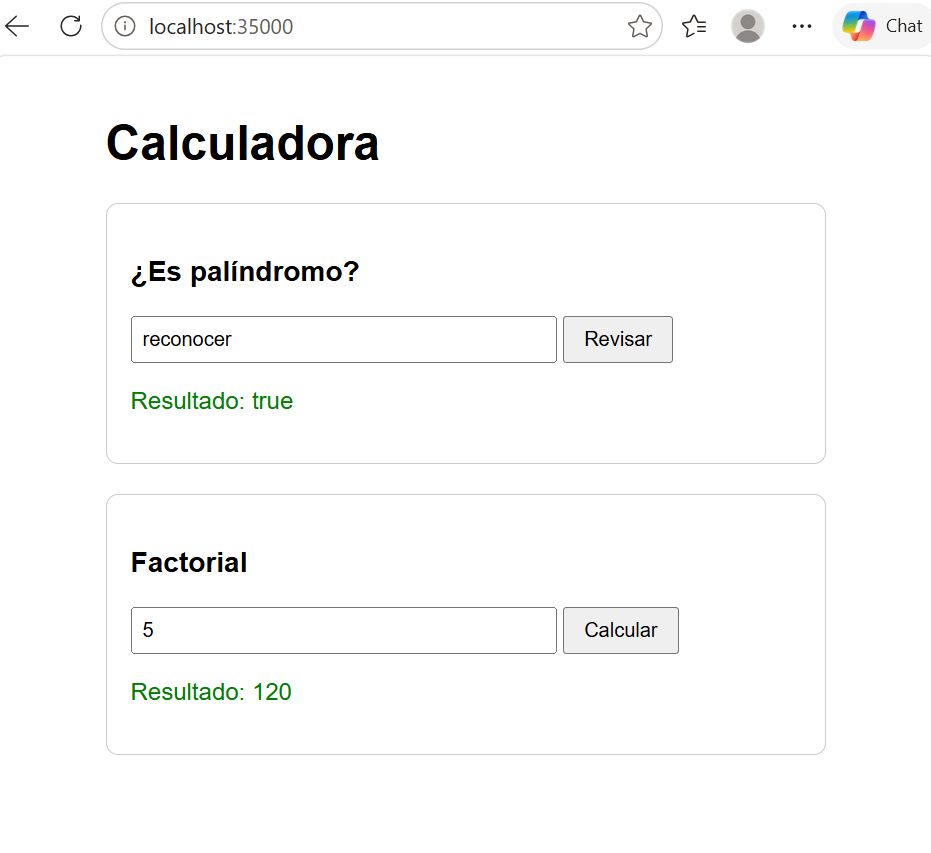
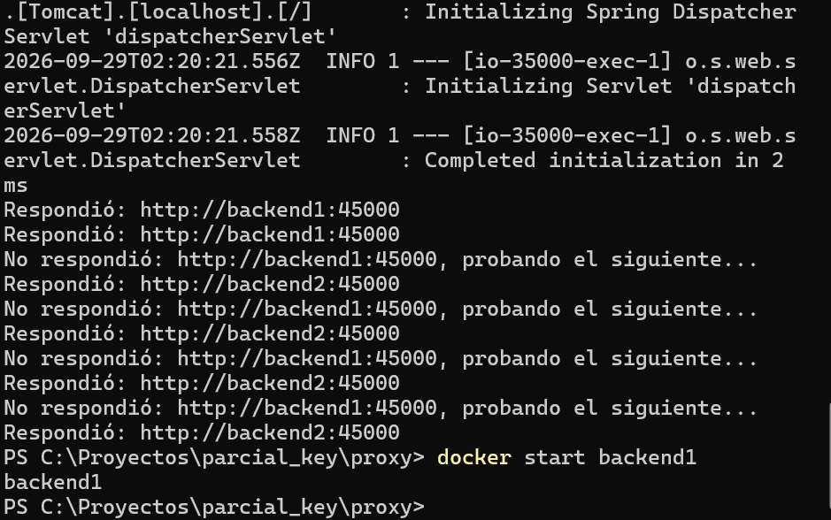
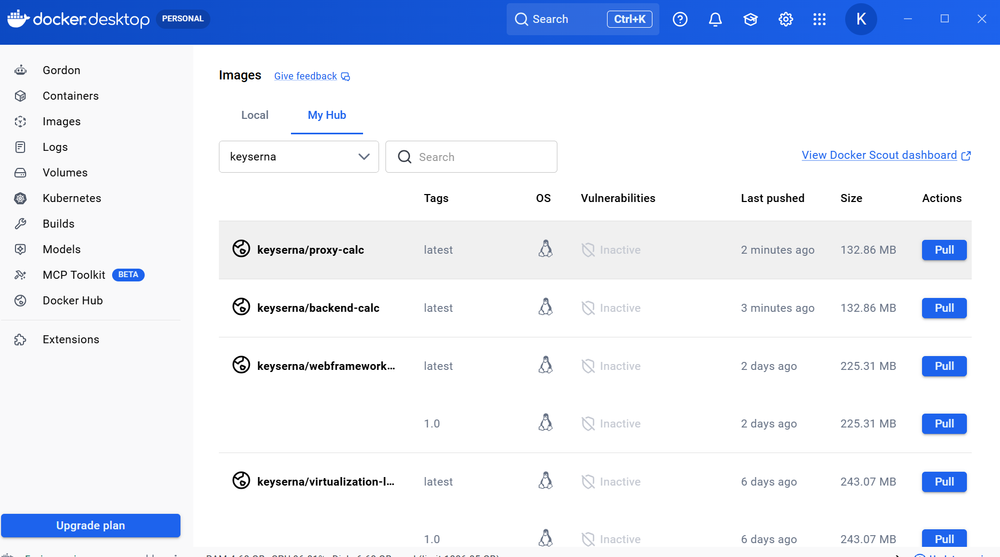
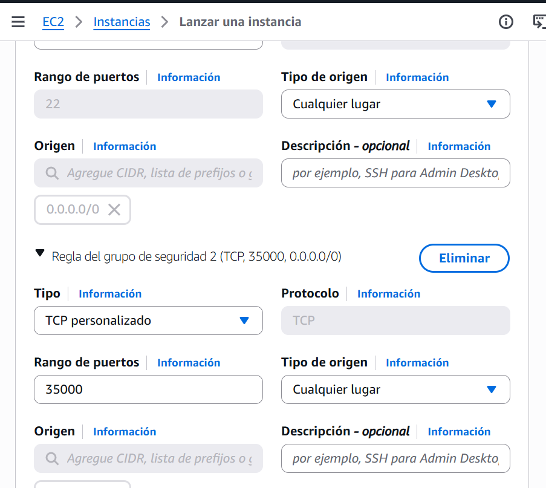
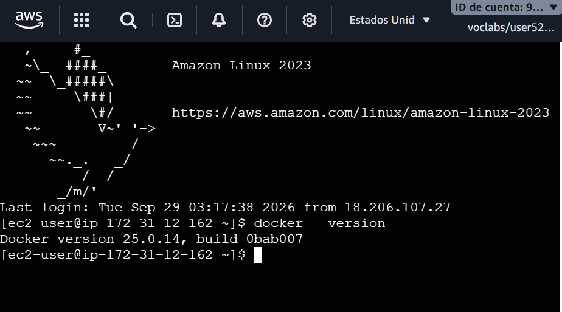
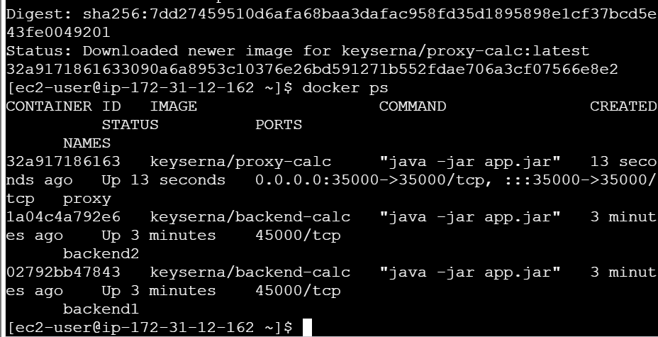
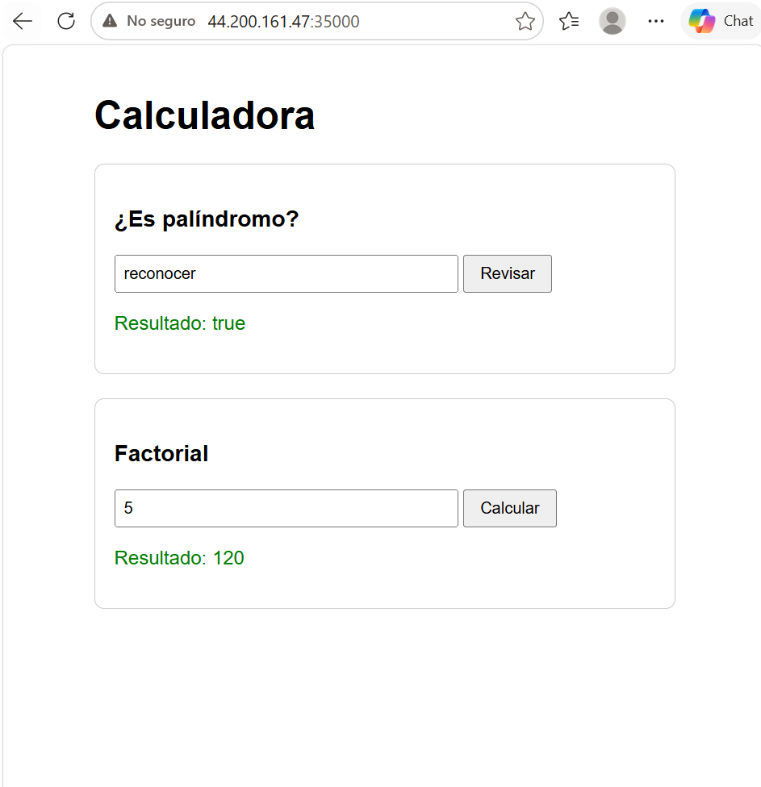
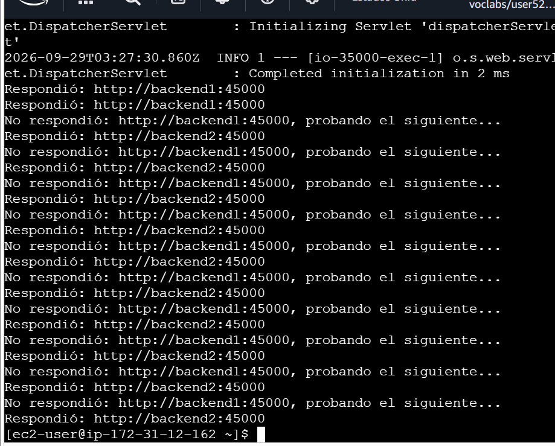

# Calculadora distribuida: Proxy + Backends con tolerancia a fallos

Autora: Keyla Yunuette Serna Illescas
Escuela Colombiana de Ingeniería Julio Garavito

## Descripción

Aplicación web que revisa si una palabra es palíndromo y calcula el factorial de un número.
Está formada por dos aplicaciones Spring Boot:

- **Backend** (puerto 45000): contiene la lógica de negocio (`MathService`) y expone los servicios REST `/palindrome` y `/factorial` (`MathController`).
- **Proxy** (puerto 35000): sirve la página web y reenvía cada petición a una lista de backends. Si un backend no responde, prueba con el siguiente (tolerancia a fallos).

```
Navegador  ->  Proxy (35000)  ->  Backend 1 (45000)
                             \->  Backend 2 (45000)
```

## Servicios REST

| Ruta | Ejemplo | Respuesta |
|---|---|---|
| `/palindrome?value=` | `/palindrome?value=reconocer` | `{"operation":"palindrome","input":"reconocer","output":true}` |
| `/factorial?value=` | `/factorial?value=5` | `{"operation":"factorial","input":"5","output":"120"}` |

**Manejo de errores:** si se envía texto o un número negativo al factorial, el backend responde **400 Bad Request** con un mensaje de error. Si ningún backend está disponible, el proxy responde **503 Service Unavailable**.

**Decisiones de diseño:**

- El factorial usa `BigInteger` para evitar el desbordamiento de `int` a partir de 13!.
- El palíndromo ignora mayúsculas y espacios ("Anita lava la tina" -> true).
- El proxy distingue dos tipos de error: si el backend responde con error (400) se lo devuelve al usuario; si el backend no responde, prueba el siguiente.
- La lista de backends se configura con la variable de entorno `BACKENDS`, sin cambiar código.
- En AWS solo se abren los puertos 22 (SSH) y 35000 (proxy); los backends solo son accesibles dentro de la red de Docker.

## Estructura

```
backendd/   -> backend: BackendApplication, MathController, MathService, MathServiceTest, Dockerfile
proxy/      -> proxy: ProxyApplication, ProxyController, static/index.html, Dockerfile
images/     -> evidencias
```

## Pruebas unitarias

Se prueba `MathService` con JUnit 5 (7 pruebas): palíndromos válidos e inválidos, espacios y mayúsculas, factorial de 5, de 0, de un número grande (25) y de un número negativo.

```
cd backendd
mvn test
```

## Construcción

```
cd backendd
mvn clean package
cd ../proxy
mvn clean package
```

## Despliegue con Docker

```
docker network create calc-net
docker run -d --name backend1 --network calc-net --restart always keyserna/backend-calc
docker run -d --name backend2 --network calc-net --restart always keyserna/backend-calc
docker run -d --name proxy --network calc-net -p 35000:35000 --restart always -e BACKENDS=http://backend1:45000,http://backend2:45000 keyserna/proxy-calc
```

Imágenes en Docker Hub: `keyserna/backend-calc` y `keyserna/proxy-calc`.

La misma secuencia se ejecutó en una instancia EC2 (Amazon Linux 2023) con Docker instalado.

## Evidencias

### Contenedores en local


### Aplicación en local (Docker)


### Tolerancia a fallos en local


### Imágenes en Docker Hub


### Grupo de seguridad en AWS (puertos 22 y 35000)


### Docker instalado en EC2


### Contenedores en EC2


### Aplicación desplegada en AWS


### Tolerancia a fallos en AWS

